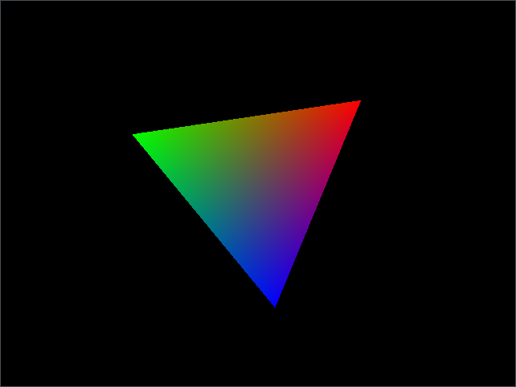

# glfw-sandbox

## Build and install

```console
mkdir build
cd build
cmake ..
cmake --build .
cmake --install .
```

## Run

```console
$ ./dist/bin/demo
```

Should output a spinning triangle like:


